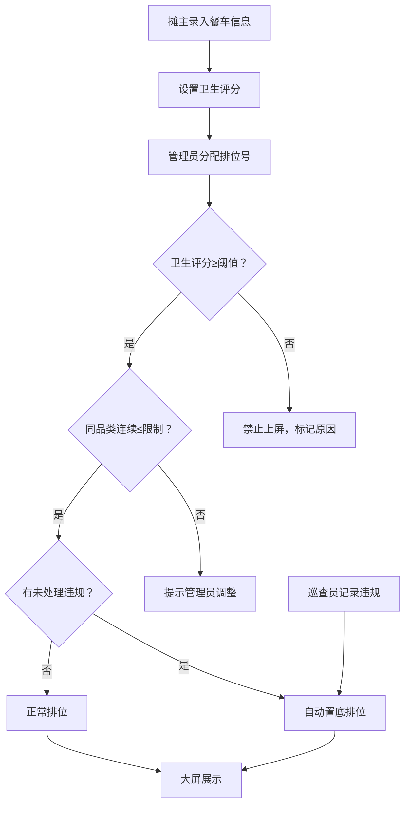

## 1. 产品概述

夜市餐车排位屏管理系统，用于规范化管理夜市餐车排位秩序。通过多角色协作（摊主、管理员、巡查员）实现餐车信息维护、排位调整、违规记录和大屏展示，确保卫生合规、品类均衡的夜市运营秩序。

### 核心价值
- 保障食品安全：卫生评分低于阈值的餐车禁止上屏
- 优化消费体验：同品类连续排位不超过限制，提升品类多样性
- 维护市场秩序：违规餐车自动置底，建立公平竞争机制

---

## 2. 核心功能

### 2.1 用户角色

| 角色 | 登录方式 | 核心权限 |
|------|----------|----------|
| 餐车摊主 | 角色切换 | 维护车辆信息、品类、卫生评分，查看排位状态 |
| 市场管理员 | 角色切换 | 调整排位号，设置系统参数（评分阈值、品类限制） |
| 巡查员 | 角色切换 | 记录餐车违规行为，查看违规历史 |
| 现场大屏 | 角色切换 | 展示可上屏餐车名单，实时更新排位信息 |

### 2.2 功能模块

1. **餐车管理**：餐车信息CRUD、品类维护、卫生评分管理
2. **排位管理**：排位号调整、自动排位算法、排位预览
3. **违规管理**：违规记录、违规类型配置、违规餐车处理
4. **大屏展示**：可上屏名单展示、实时状态更新、滚动播报
5. **系统设置**：卫生评分阈值、同品类连续限制数量
6. **数据筛选**：按品类、评分、状态筛选，支持多维度排序

### 2.3 页面详情

| 页面名称 | 模块名称 | 功能描述 |
|----------|----------|----------|
| 餐车管理页 | 餐车列表 | 展示所有餐车，支持新增、编辑、删除、筛选、排序 |
| 餐车管理页 | 餐车表单 | 车牌号、摊主姓名、经营品类、卫生评分录入与修改 |
| 排位管理页 | 排位列表 | 展示当前排位顺序，支持拖拽调整排位号 |
| 排位管理页 | 排位预览 | 模拟大屏展示效果，预览最终上屏名单 |
| 违规记录页 | 违规列表 | 展示所有违规记录，支持新增违规、筛选查询 |
| 违规记录页 | 违规表单 | 选择餐车、违规类型、描述、处理方式录入 |
| 大屏展示页 | 上屏名单 | 滚动展示可上屏餐车，包含排位号、品类、评分 |
| 系统设置页 | 参数配置 | 设置卫生评分阈值、同品类连续排位限制数量 |

---

## 3. 核心流程

### 3.1 业务主流程

摊主注册餐车 → 录入卫生评分 → 管理员分配排位号 → 系统校验规则 → 合格餐车上屏展示

### 3.2 违规处理流程

巡查员发现违规 → 记录违规信息 → 系统自动将餐车置底 → 大屏实时更新排位

### 3.3 流程图

---

## 4. 用户界面设计

### 4.1 设计风格

**夜市霓虹风格**：以深色背景为基底，搭配霓虹灯光效果，营造夜市热闹氛围。

- **主色调**：深靛蓝 `#0a0e27`（夜幕背景）
- **辅助色**：霓虹粉 `#ff2a6d`、霓虹青 `#05d9e8`、霓虹黄 `#f9c80e`
- **功能色**：成功绿 `#00ff9d`、警告橙 `#ff6b35`、危险红 `#ff2a6d`
- **按钮风格**：霓虹发光边框，悬停时增强发光效果
- **字体**：展示字体使用 Orbitron（科技感），正文字体使用 Noto Sans SC（易读性）
- **布局风格**：卡片式布局，玻璃拟态效果，网格化排列
- **图标风格**：线性霓虹图标，发光效果

### 4.2 页面设计概览

| 页面名称 | 模块名称 | UI 元素 |
|----------|----------|---------|
| 餐车管理页 | 餐车卡片 | 霓虹边框卡片，车牌号发光显示，评分星级展示 |
| 排位管理页 | 排位列 | 拖拽排序，违规标记红色警示，低评分置灰 |
| 大屏展示页 | 上屏名单 | 大字号滚动展示，霓虹配色，动态流光效果 |
| 违规记录页 | 违规列表 | 时间线布局，违规类型标签化展示 |
| 系统设置页 | 参数卡片 | 滑块调节阈值，实时预览规则效果 |

### 4.3 响应式设计

- **桌面优先**：1920px 大屏展示优化
- **平板适配**：1024px 网格重排
- **手机适配**：375px 单列布局，触控优化
- **大屏展示**：支持全屏模式，字体自适应缩放

### 4.4 动效设计

- 页面加载：霓虹灯光逐一点亮的入场动画
- 卡片悬停：边框发光增强，轻微上浮效果
- 排位调整：拖拽时的磁吸动效，放置后的弹性动画
- 大屏滚动：平滑的 marquee 滚动，流光扫过效果
- 违规提示：红色脉冲闪烁提醒
