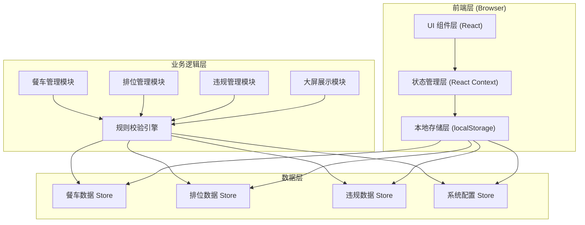
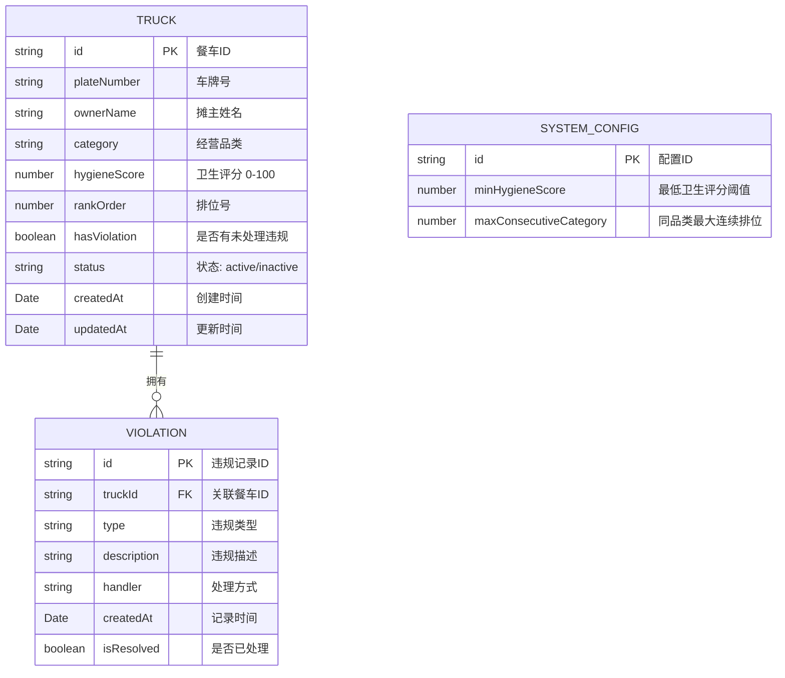
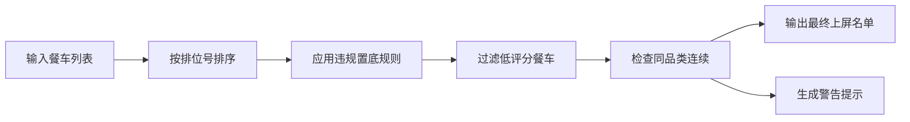

## 1. 架构设计



---

## 2. 技术选型说明

### 2.1 技术栈
- **前端框架**：React@18 + TypeScript
- **构建工具**：Vite@5
- **样式方案**：TailwindCSS@3 + CSS Variables（霓虹主题）
- **状态管理**：React Context + useReducer
- **拖拽排序**：@dnd-kit/core（轻量、高性能）
- **图标库**：Lucide React（线性图标，适配霓虹风格）
- **本地存储**：localStorage（持久化数据）
- **动画**：Framer Motion（复杂动效）+ CSS Animations（基础动效）

### 2.2 选型理由
- 纯前端实现，无需后端服务，满足用户要求的浏览器本地存储
- React + TypeScript 保证代码质量和可维护性
- TailwindCSS 快速构建霓虹风格 UI
- @dnd-kit 实现流畅的拖拽排位体验

---

## 3. 路由定义

| 路由路径 | 页面名称 | 权限角色 |
|----------|----------|----------|
| / | 首页导航 | 所有角色 |
| /trucks | 餐车管理 | 摊主、管理员 |
| /ranking | 排位管理 | 管理员 |
| /violations | 违规记录 | 巡查员、管理员 |
| /display | 大屏展示 | 现场大屏 |
| /settings | 系统设置 | 管理员 |

---

## 4. 数据模型

### 4.1 ER 图



### 4.2 TypeScript 类型定义

```typescript
// 餐车信息
interface Truck {
  id: string;
  plateNumber: string;
  ownerName: string;
  category: string;
  hygieneScore: number;
  rankOrder: number;
  hasViolation: boolean;
  status: 'active' | 'inactive';
  createdAt: string;
  updatedAt: string;
}

// 违规记录
interface Violation {
  id: string;
  truckId: string;
  type: string;
  description: string;
  handler: string;
  createdAt: string;
  isResolved: boolean;
}

// 系统配置
interface SystemConfig {
  id: string;
  minHygieneScore: number;
  maxConsecutiveCategory: number;
}

// 排位校验结果
interface RankValidationResult {
  valid: boolean;
  reason?: string;
  warnings?: string[];
}
```

### 4.3 localStorage 存储键

| 键名 | 数据类型 | 说明 |
|------|----------|------|
| `night_market_trucks` | `Truck[]` | 餐车列表 |
| `night_market_violations` | `Violation[]` | 违规记录列表 |
| `night_market_config` | `SystemConfig` | 系统配置 |

---

## 5. 核心业务规则引擎

### 5.1 规则定义

1. **卫生评分规则**：`hygieneScore >= minHygieneScore` 才能上屏
2. **同品类连续规则**：相邻排位的同品类餐车不超过 `maxConsecutiveCategory` 个
3. **违规置底规则**：有未处理违规的餐车自动排到最后

### 5.2 规则校验流程



---

## 6. 项目目录结构

```
src/
├── components/          # 通用组件
│   ├── NeonCard.tsx     # 霓虹卡片
│   ├── NeonButton.tsx   # 霓虹按钮
│   ├── Navbar.tsx       # 导航栏
│   └── RoleSwitcher.tsx # 角色切换器
├── pages/               # 页面组件
│   ├── Home.tsx
│   ├── TruckManagement.tsx
│   ├── RankingManagement.tsx
│   ├── ViolationRecords.tsx
│   ├── DisplayScreen.tsx
│   └── Settings.tsx
├── context/             # 状态管理
│   ├── TruckContext.tsx
│   ├── ViolationContext.tsx
│   └── ConfigContext.tsx
├── hooks/               # 自定义 Hooks
│   ├── useLocalStorage.ts
│   └── useRankValidation.ts
├── utils/               # 工具函数
│   ├── storage.ts
│   ├── validation.ts
│   └── mockData.ts
├── types/               # 类型定义
│   └── index.ts
├── styles/              # 全局样式
│   └── neon-theme.css
├── App.tsx
├── main.tsx
└── vite-env.d.ts
```
